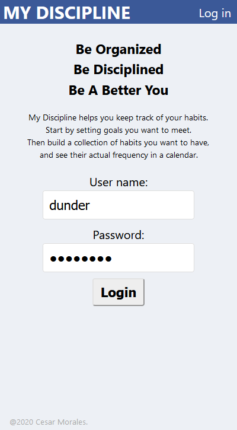
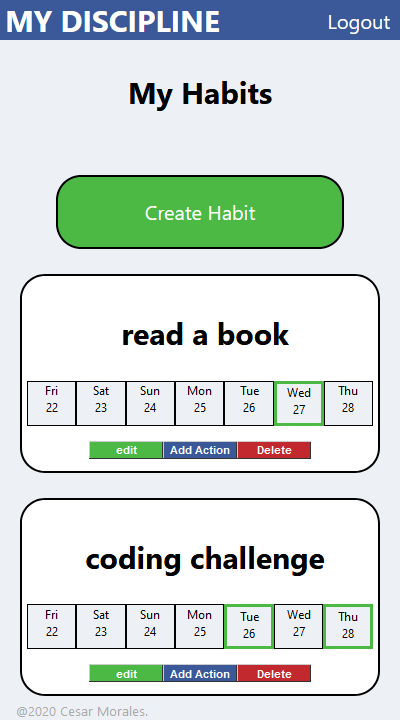
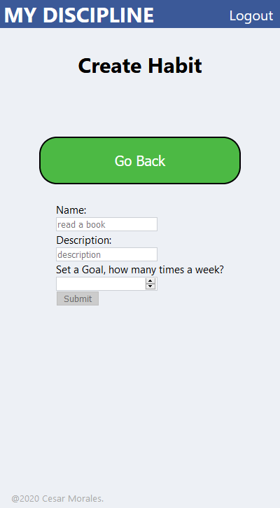
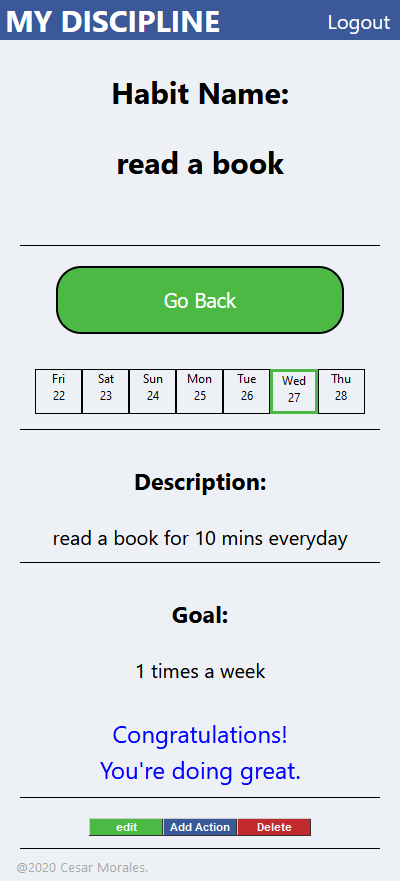
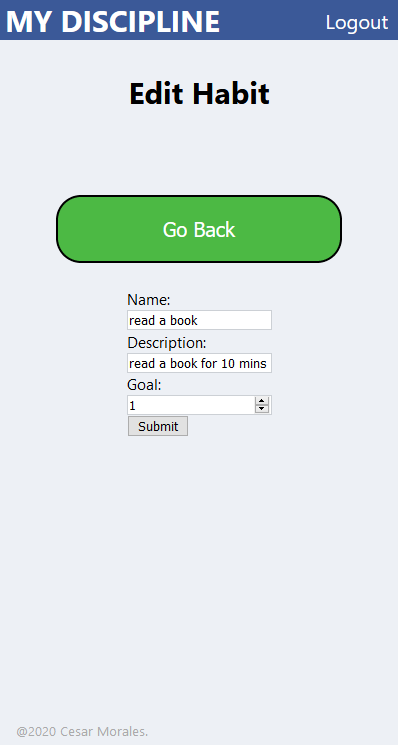
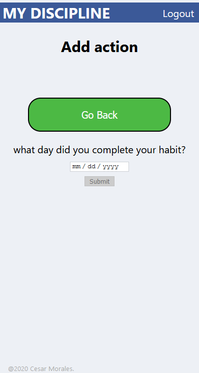

## Application
My Discipline

## Links
live site: [https://my-discipline.cesarlenin.now.sh/](https://my-discipline.cesarlenin.now.sh/) 
backend:[https://git.heroku.com/my-discipline.git/](https://git.heroku.com/my-discipline.git/)

## Using The API

## Screen Shots
 
 
 
 
 
 

### Summary

## Technologies
  - React
  - Node.js
  - JavaScript
  - Postgresql 
  - Mocha, Chai
  
## Setting Up The Dev Server
